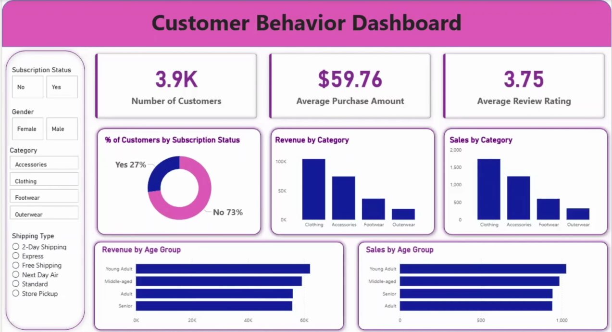

# Customer Behaviour Analysis

---

## Table of Contents
- [Project Overview](#project-overview)
- [Tech Stack](#tech-stack)
- [Dataset](#dataset)
- [Business Questions Addressed with SQL](#business-questions-addressed-with-sql)
- [Business Questions Explored in Python EDA](#business-questions-explored-in-python-eda)
- [Power BI Dashboard](#power-bi-dashboard)
- [Dashboard Screenshots](#dashboard-screenshots)
- [Key Insights](#key-insights)

---

## 🚀 Project Overview
This project performs a comprehensive **Customer Behaviour Analysis** on e-commerce shopping data using **Python** for exploratory data analysis, **SQL** for querying key metrics, and **Power BI** for building interactive visualizations.

The main objective is to uncover hidden trends in customer shopping patterns, understand preferences across demographics, and deliver actionable business insights to boost revenue, improve customer retention, and optimize marketing strategies.

**Key Goals:**
- Analyze revenue distribution across gender, age groups, locations, and customer segments
- Identify top-performing products, categories, and seasonal trends
- Evaluate the impact of discounts, promo codes, and subscriptions on customer spending
- Segment customers based on loyalty, purchase frequency, and RFM principles
- Create interactive Power BI dashboards for stakeholder-friendly insights

---

## 🛠 Tech Stack
- **Python** – Exploratory Data Analysis (EDA) & Advanced Visualizations
- **SQL** (MySQL) – Data querying, aggregation, and KPI calculation
- **Power BI** – Interactive dashboards and reporting
- **Python Libraries**: `pandas`, `numpy`, `matplotlib`, `seaborn`, `plotly`

---

## 📊 Dataset
The dataset consists of anonymized e-commerce customer shopping behavior records with key columns including:

- `Customer_ID`, `Age`, `Gender`, `Location`
- `Category`, `Product_ID`, `Purchase_Amount (USD)`
- `Discount_Applied (Yes/No)`, `Promo_Code_Used (Yes/No)`
- `Subscription_Status (Yes/No)`, `Review_Rating`
- `Shipping_Method`, `Previous_Purchases`, `Total_Purchases`
- `Age_Group` (derived)

---

## 🔍 Business Questions Addressed with SQL

Click to expand SQL business questions

1. **Total Revenue by Gender**  
   How much revenue is generated by male versus female customers?

2. **Customers Using Discounts and Spending Above Average**  
   Which customers apply discounts and still spend more than the overall average purchase amount?

3. **Top 5 Products by Average Review Rating**  
   Which products have the highest average customer review ratings?

4. **Average Purchase Amount by Shipping Method**  
   How does the average purchase amount vary across different shipping methods?

5. **Revenue and Average Spending by Subscription Status**  
   Do subscribed customers spend more on average and contribute more to total revenue compared to non-subscribed customers?

6. **Top 5 Products with Highest Discount Usage Percentage**  
   Which products are most frequently purchased with a discount applied?

7. **Customer Segmentation (New, Returning, Loyal)**  
   How can customers be segmented into New, Returning, and Loyal based on their previous purchase history?

8. **Top 3 Products per Category by Purchase Count**  
   What are the top 3 best-selling products in each product category?

9. **High-Frequency Buyers with Subscription**  
   Which high-frequency buyers (more than 5 previous purchases) have an active subscription?

10. **Revenue Contribution by Age Group**  
    How much revenue does each age group contribute to the total?

---

## 📈 Business Questions Explored in Python EDA

Click to expand Python EDA business questions

1. **Distribution of Purchase Amounts**  
   What is the overall distribution of purchase amounts, and are there any outliers or patterns?

2. **Spending Patterns by Gender**  
   Do male and female customers show different spending behaviors or preferences?

3. **Spending Patterns by Age and Age Group**  
   How does customer spending vary across different age brackets?

4. **Spending Patterns by Location**  
   Are there regional differences in average order value or purchase frequency?

5. **Category-Wise Revenue Breakdown**  
   Which product categories contribute the most to total revenue?

6. **Impact of Discounts on Purchase Behavior**  
   How do discounts affect average order value, purchase frequency, and repeat purchases?

7. **Impact of Promo Codes on Spending**  
   Does the use of promo codes lead to higher transaction values or increased loyalty?

8. **Subscription Impact on Customer Loyalty and AOV**  
   Do subscribed customers have higher average order values and more frequent purchases?

9. **Customer-Level Purchase Frequency and Total Spend**  
   How is purchase frequency distributed, and how strongly does it correlate with total customer lifetime value?

10. **Average Order Value (AOV) Trends**  
    What factors most influence variations in average order value across customer segments?

11. **Correlation Between Review Ratings and Purchase Amount**  
    Do higher-rated products tend to have higher purchase amounts or repeat buyers?

12. **Seasonality in Purchasing Behavior**  
    Are there detectable seasonal trends or patterns in sales volume and revenue?

---

## 📊 Power BI Dashboard

The interactive Power BI dashboard provides stakeholder-friendly visualizations with slicers for filtering by gender, age group, location, category, subscription status, and more.

**Key Features:**
- Revenue breakdown by demographics, location, and category
- Top-performing products and categories
- Customer segmentation visuals (New / Returning / Loyal)
- Impact analysis of discounts, promo codes, and subscriptions
- KPI cards: Total Revenue, Average Order Value, Total Customers, Subscription Rate

---

## 🖼️ Dashboard Screenshots

## 🔑 Key Insights
- Subscribed customers exhibit significantly higher average order value and purchase frequency
- Discounts and promo codes effectively drive repeat purchases but can slightly reduce transaction value
- Certain product categories dominate revenue, with clear top-performing products
- Loyal customers contribute disproportionately to total revenue
- Age, gender, and location show distinct spending preferences, enabling targeted marketing

---